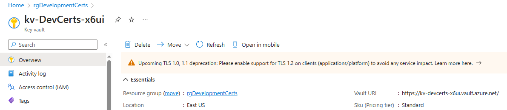
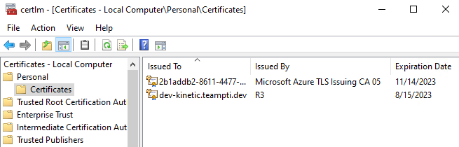
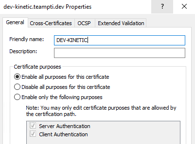

# Installing Azure Arc

At the dev server you want to add to Azure arc, go to the [Azure Portal](https://portal.azure.com) and log into your Azure account.

### Create Resource Group

Create a Resource Group in the same region as the Key Vault.


### Add Azure Arc Service

When the group is created, go to it and click the 'Create' button. In the Marketplace search for 'Servers - Azure Arc'


Click on the Panel.

### Add the Server


Click on the 'Generate Script' button for the 'Add a single server' panel.


- Choose the Resource Group created above.
- Select the same Region as the Resource Group and the Key Vault
- Unless you have a private endpoint or go through a proxy, use the Public Endpoint.
- Leave the Automanage check box cleared for now. Your company may decide to use it but it will incur more costs.

Add tags if you want to do reports later in Azure then click 'Next'.


### Run the PowerShell Script

The portal will display a PowerShell script that you can copy or download to the development server. Open Powershell and paste (or run the ps1 file). This will download an agent to the server, install it, then the agent will connect to Azure. The agent will self-update as needed. The script will authenticate to your Azure account but you should be able to pick the account from the login screen since you are already logged in.

When finished, the PowerShell window will say: 'INFO  Connected machine to Azure.'

Click the 'Close' button in the port. You may get a message about not saving changes but you can safely continue.

### Check the Portal

Go back to the Resource Group created above and click the 'Refresh' icon on the top menu. You should see your server as a Resource.


### Grant permissions to the Vault

Now that the development server has a managed Identity, we can give permissions to the vault and the certificate.

### Install the Key Vault Extension

While the Key Vault Extension is generally available, at the time of this writing, it does not appear in the Azure Portal. It must be installed via an ARM template or PowerShell. We will use PowerShell. Open a PowerShell window on the development server. Install the Azure Connected Machine PowerShell library.

```powershell
install-module az.ConnectedMachine
```

Copy this PowerShell to a text editor:
```powershell
$ResourceGroup = "rgArcDevServers"
$ArcMachineName = "dev-kinetic"
$Location = "eastus"
$SubscriptionID = ""

$Settings = @{
    secretsManagementSettings = @{
      observedCertificates = @(
        "https://VAULTNAME.vault.azure.net/secrets/CERTNAME"
        # Add more here in a comma separated list
      )
      certificateStoreLocation = "LocalMachine"
      certificateStoreName = "My"
      pollingIntervalInS = "86400" # every day
    }
    authenticationSettings = @{
      # Don't change this line, it's required for Arc enabled servers
      msiEndpoint = "http://localhost:40342/metadata/identity"
    }
  }
  
  New-AzConnectedMachineExtension -ResourceGroupName $ResourceGroup -SubscriptionId $SubscriptionID -MachineName $ArcMachineName -Name "KeyVaultForWindows" -Location $Location -Publisher "Microsoft.Azure.KeyVault" -ExtensionType "KeyVaultForWindows" -Setting $Settings
```

Replace the values in $ResourceGroup (Your Arc Server resource group), $ArcMachineName, $Location, and $SubscriptionID with your values.

Next, replace VAULTNAME with the vault name. You can get the name by going to the vault resource (begins with kv-) and see the Vault URL in the Overview.



Then replace CERTNAME with the name of the CERT.

In the $Settings, the certificateStoreLocation can be "My" for the Personal folder or "WEB" for the Web Server store. Both seem to work. The pollingIntervalInS is the number of seconds to check for a new certificate. Since by default, KeyVault-Acmebot will renew 30 days before expiration, checking once a day (86400) is probably good enough. Key Vault is billed by number of transactions, so no need to call too often.

Run the script by pasting into a PowerShell window. The installation will take a few minutes, so be patient.

If you decide to change the settings later, you can use the following PowerShell script. (You may need to install the Azure Connected Machine module again.) Remember to update $ResourceGroup, $ArcMachineName, and your $SubscriptionID.

```powershell
  # install-module az.ConnectedMachine if not installed

  # Connect To Azure with the current account
  Connect-AzAccount

  $ResourceGroup = "rgArcDevServers"
  $ArcMachineName = "dev-kinetic"
  $SubscriptionID = ""

  $Settings = @{
    secretsManagementSettings = @{
      observedCertificates = @(
        "https://VAULTNAME.vault.azure.net/secrets/CERTNAME"
        # Add more here in a comma separated list
      )
      certificateStoreLocation = "LocalMachine"
      certificateStoreName = "My"
      pollingIntervalInS = "43200" # twice a day
    }
    authenticationSettings = @{
      # Don't change this line, it's required for Arc enabled servers
      msiEndpoint = "http://localhost:40342/metadata/identity"
    }
  }
  

  Update-AzConnectedMachineExtension -ResourceGroupName $ResourceGroup -SubscriptionId $SubscriptionID -MachineName $ArcMachineName -Name "KeyVaultForWindows" -Publisher "Microsoft.Azure.KeyVault" -Setting $Settings
```

Again, paste this updated script into a PowerShell window. This will also take a few minutes.

Finally, let's check the server to see if the certificate was installed. Open the Certificates plug-in in the Management Console. Open the Personal Folder and click on Certificates.



Let's Encrypt certificates will be issued by R3. They come without a Friendly Name. Right-click the certificate and choose 'Properties', then fill in the Friendly Name and press 'OK'.

