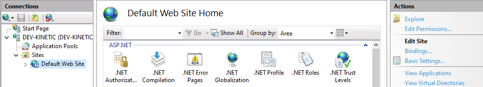
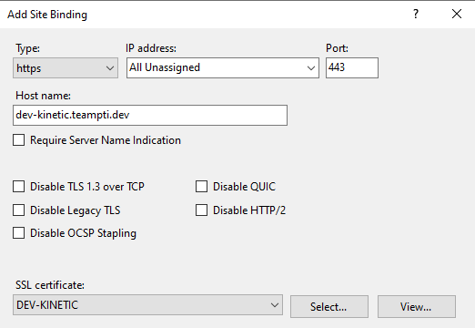
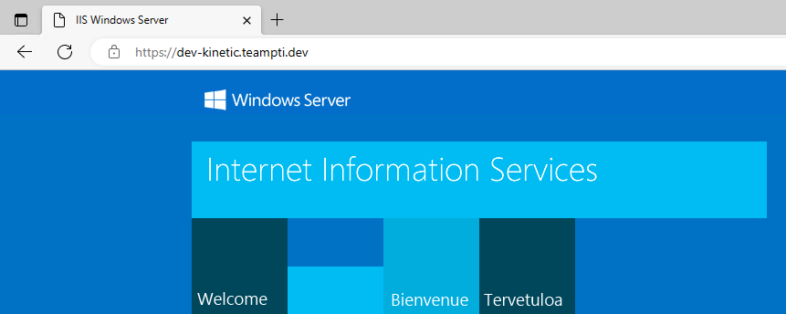
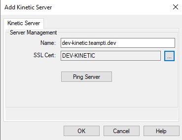

# Install Kinetic

We have a server with a valid TLS certificate. Let's install Kinetic.

### Set DNS Suffix

In my case, I am are using a .dev domain and not running DNS for it. IPCONFIG /ALL shows the DNS Suffix is mshome.net by default. To set it to the .dev domain, use the netdom command:

```bash
netdom computername dev-kinetic /add:dev-kinetic.teampti.dev

netdom computername dev-kinetic /makeprimary:dev-kinetic.teampti.dev
```

Reboot the computer to complete this operation. IPCONFIG /ALL will now show the new Primary Dns Suffix.

### Kinetic Prerequisites

Install the Windows Server Roles and Features according to the Kinetic Installation Guide for your version.

Open the IIS Manager and expand the tree to get to the 'Default Web Site'. On the right hand side, choose 'Bindings...' in the 'Edit Site' section.



In the 'Add Site Binding' window, click the 'Add...' button.



- Set the 'Type' to https.
- Enter the full domain name for the server
- From the 'SSL certificate' dropdown, choose the certificate.
- Press 'OK'
- Restart the Website

Open the web browser and enter the server's full address. In this case, 'https://dev-kinetic.teampti.dev' If everything is correct, you should see the default IIS page.



### Install Kinetic

Perform the usual steps in the installation guide. When you get to adding the Kinetic server. Make sure the name is the fully qualified server name, like dev-kinetic.teampti.dev. If it's just the server without the domain, go back and fix your DNS.



Since we already did the binding, the 'SLL Cert' should already be selected.

