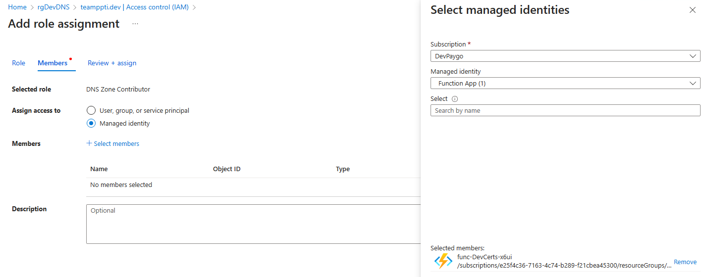

# Installing Keyvault-Acmebot

Open [KeyVault-Acmebot Getting Started](https://github.com/shibayan/keyvault-acmebot/wiki/Getting-Started) to begin. This article will guide you through the steps.

The easiest way to install this solution is to log into your Azure account then choose the appropriate "Deploy to Azure" button.

This screen will appear.

- Choose Your Development Subscription
- Create a new Resource Group and choose another region besides Central US.
- Pick a Region (Again, I have not had luck with Central US, so use another Region that is the same as the Resource Group)
- For App Name Prefix, use something like DevCerts. This will become a part of your function name.
- Leave location as is. It is using the Resource Group Location
- Mail Address. Let's Encrypt will send notifications to this email address. 
- We're using Let's Encrypt, use the letsencrypt.org endpoint.
- Create With Key Vault: Leave true. You can have as many Key Vaults as you like. Azure charges by number of calls and not the number of vaults. Vault call are inexpensive.
- Choose the Standard Key Vault SKU as it is less expensive.
- Leave the Key Vault Base Url blank since we are creating a new Key Vault.

Click on Review + Create. After a few minutes, you will be able to view the new resource group.

Here are the resources the deployment creates:

There are four trailing characters on some of the resources to ensure no collisions with other Azure Functions. Click on the Function App (begins with 'func-') to add or change application settings.

You should have to add or change anything but one entry is interesting. If you run Slack or Teams, you can put a WebHook URL to post a success or failure message. Just add an entry, call it 'Acmebot:Webhook' and add the webhook URL. You will have to restart the app service before it goes into effect.

### Configure DNS

Next we need to configure DNS. Stay on the configuration screen above and add a new entry: 'Acmebot:AzureDns:SubscriptionId'. The value is the subscription ID of the Azure DNS service. For this example, I'm using the Dev Subscription from the pre-requisites. Following good least privilege access, an Azure resource has access to nothing and must be explicitly granted to other resources.

Go to the Azure DNS Target zone - in this case my .DEV domain. Click on the 'Access control (IAM)' menu item and press the 'Add role assignment' button.

Choose 'DNS Zone Contributor'. Press 'Next'. Check 'Managed identity' in the 'Assign access to' field. On the slide out on the right, choose 'Function App' for the 'Managed identity', click on the function app that begins with 'func-' and press 'select'. Finally, click on 'Review + assign' (maybe twice for confirmation). You will get a message when the role has been assigned. Now the function app has the capability to add a TXT record to prove to Let's Encrypt that we control the domain.

// to do Managed identity note

### Add Authentication

Next we need to add authentication to our function app. We only want to ensure users are logged in before they can access our new dashboard. Go back to the Function App and click on the 'Authentication' menu item and click on 'Add identity provider'.

Select 'Microsoft' in the provider dropdown. In the next screen, accept the defaults and click 'Add'

### Open Dashbord

If all is well, we can open our dashboard. Go to the 'Overview' menu item in the function app. Copy the URL in the upper-right corner and paste it into a new tab. You should see a permission form pop up.

Click 'Accept'. You should now see the Key Vault Acmebot dashboard.

### Add Certificates

